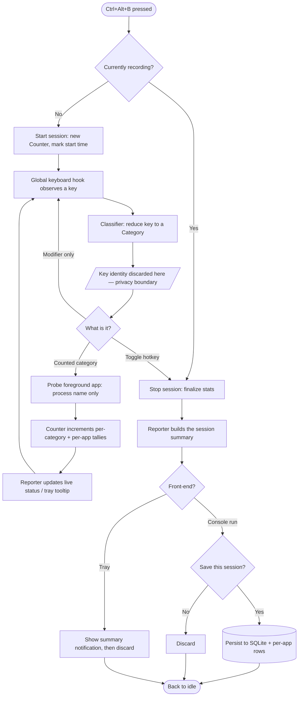

# Code Backtrack

## Project Overview

### What I Built

I designed and built **Code Backtrack**, a lightweight Windows app that measures _how much of what I type I end up deleting_ while I code. It runs quietly in the background, and at a single keystroke it starts counting correction keys — Backspace, Delete, Ctrl+Backspace, Ctrl+Z, Ctrl+X — alongside the characters I actually type, then turns that into one honest number: **delete %** — the share of typed content that gets removed again.

The defining constraint is what the app _refuses_ to do. It is a **counter, not a keylogger**. Every key event is reduced to a category and immediately discarded at a single privacy boundary; the key's identity never leaves that module. Only aggregate counts and timestamps are ever held in memory or written to disk, so the tool can answer "how often do I correct myself" without ever knowing _what_ I typed.

The app grew across four deliberately scoped versions: a console **counter** with a global hotkey (v1), **SQLite history** with a per-app breakdown (v2), the headline **character metric** — typed vs. deleted and the delete % (v3), and a **system-tray daily driver** that runs alongside work with no terminal at all (v4). Each version shipped with its own unit tests and a hands-on smoke test before the next began.

### Why I Built It

I built this to track how much I lean on Backspace while coding — because the habit I actually want is to **write code more confidently and more leanly**. Every correction is a small signal that I committed to a line before I was sure of it; watching the delete % over time is a way to nudge myself toward thinking first and typing once, rather than typing fast and walking it back.

- **Insight goal:** Turn a vague feeling ("I rewrite a lot") into a measurable signal I can watch over time — one readable percentage rather than a pile of raw key counts — and break it down per app so I can see _where_ the corrections cluster (editor vs. terminal vs. browser).
- **Privacy goal:** Prove that this metric can be collected **without ever reading text**. Reading the document or clipboard would require accessibility APIs — keylogger territory — so magnitudes come from _counting events_, never from inspecting content. A single Backspace is provably one character; word deletes use a fixed estimate; nothing else is ever assumed.
- **Engineering goal:** Build a small, clean pipeline — classify → count → report → persist — where each stage is pure and independently testable, the keyboard hook is the only impure edge, and new front-ends (console, tray) reuse the exact same core logic.

## Technical Overview

### System Architecture

The architecture is a one-directional pipeline: a global keyboard **hook** feeds an **event classifier** (the privacy boundary), which feeds an in-memory **counter**, whose stats are rendered by a pure **reporter** and optionally written to **SQLite**. A small **state machine** (`App`) wires those pieces to the hook and toggles between idle and recording; both front-ends — the console `run` and the v4 system **tray** — drive that same `App`.

- **Keyboard hook + classifier** ([`listener.py`](src/code_backtrack/listener.py)): subscribes to global key events via **pynput**, tracks modifier state, and reduces each press to a `Category` (or a toggle `Signal`). Key identity is discarded here and never propagates — this is the privacy line.
- **Counter core** ([`counter.py`](src/code_backtrack/counter.py)): pure, zero-I/O tallies per category and per app, plus the derived `SessionStats` — total keystrokes, correction ratio, corrections/minute, and the v3 character model (`chars_added`, `chars_deleted`, `delete_pct`, `net_chars`). The clock is injectable so the stats math is testable with known timestamps.
- **State machine** ([`app.py`](src/code_backtrack/app.py)): idle ↔ recording, toggled by the Ctrl+Alt+B hotkey or the tray menu; probes the foreground app per counted key; finalizes and (optionally) persists a session on stop.
- **Reporter** ([`reporter.py`](src/code_backtrack/reporter.py)): pure formatting only — live status line, full session summary, `history`/`apps`/`list` views, and the tray tooltip. No state, no I/O.
- **Storage** ([`storage.py`](src/code_backtrack/storage.py)): stdlib `sqlite3` at `%LOCALAPPDATA%\code-backtrack\sessions.db`, with forward-compatible column backfill so DBs from earlier versions still load.
- **Active-window probe** ([`activewindow.py`](src/code_backtrack/activewindow.py)): ctypes-only Windows API call returning the foreground **process name** (`Code.exe`) — never a window title, which would leak file names.
- **Tray front-end** ([`tray.py`](src/code_backtrack/tray.py)): a **pystray** icon with runtime-drawn **Pillow** images (grey idle / red recording), a Start/Stop menu, a live tooltip, and a stop-summary notification — storage-free by design.

### Key Components

**Privacy-boundary classifier (`listener.py`):** `EventClassifier.on_press` is where a raw key becomes an anonymous category. It folds the many ways a key can arrive (char, uppercase, virtual-key code, Ctrl control-char) into one decision, distinguishes word deletes (Ctrl held) from single deletes, recognizes the Ctrl+Alt+B toggle as a no-op-in-apps hotkey, and treats only printable content keys as typed characters. Nothing past this point knows which key was pressed.

**Counter core (`counter.py`):** The `Category` enum, the `Counter` that tallies per-category and per-app, and `compute_stats` — the single function that derives a `SessionStats` from raw tallies, used identically by the live counter and by rows loaded from storage. The v3 character model lives here, including the `WORD_DELETE_CHARS = 5` estimate for word deletes.

**Session state machine (`app.py`):** `App` is the idle ↔ recording brain shared by both front-ends. `toggle()` starts or finalizes a session; `on_press` routes a classifier result to either a toggle or a counted record; saving is **opt-in per session** on the console path and skipped entirely (`storage=None`) on the tray path.

**Storage layer (`storage.py`):** A custom SQLite layer (no ORM) with a column-per-category schema, generated DDL, and an `_add_missing_count_columns` migration that `ALTER TABLE ... DEFAULT 0`s any column introduced in a later version — so a v1 database opens cleanly under v4.

**Tray controller (`tray.py`):** `TrayController` binds an `App` to an injected icon object (injected so it's testable with a fake), funnels both the hotkey and the menu through `App.toggle` under a lock, and applies all visible state — icon image, tooltip, transition notification — in one `refresh` so a hotkey toggle and a menu toggle update the UI identically.

### Grounding the Metric in Counting, Not Reading

The headline number never comes from inspecting text. `chars_added` counts only printable content keys; `chars_deleted` is single-char deletes (exactly one each) plus word deletes valued at a fixed five-character estimate; undo, overtype, and cut are excluded from the character totals because they have no defensible size. This is the core design decision: a **single Backspace is provably one character**, so the delete % is trustworthy without the app ever crossing into reading the document or clipboard.

## Code in Action: A Recording Session

### 1. A key event is classified — and its identity discarded (`listener.py`)

```python
if key == keyboard.Key.backspace:
    # Shift is irrelevant; Ctrl distinguishes a word delete from a single delete.
    return Category.CTRL_BACKSPACE if ctrl else Category.BACKSPACE

if _is_printable(key) and not ctrl and not alt:
    # A typed content character = added text (v3). Space/Enter/Tab are special
    # keys (no .char), so they fall through to OTHER — structure, not content.
    return Category.CHAR
```

### 2. The state machine records it under the active app (`app.py`)

```python
def on_press(self, key):
    result = self._classifier.on_press(key)
    if result is Signal.TOGGLE:
        self.toggle()
    elif isinstance(result, Category) and self._counter is not None:
        self._counter.record(result, app=self._probe())  # process name only
        self._show_status()
```

### 3. The counter derives the headline metric (`counter.py`)

```python
chars_added = full_counts[Category.CHAR]
chars_deleted = (
    full_counts[Category.BACKSPACE]
    + full_counts[Category.DELETE]
    + (full_counts[Category.CTRL_BACKSPACE] + full_counts[Category.CTRL_DELETE])
    * WORD_DELETE_CHARS
)
delete_pct = chars_deleted / chars_added if chars_added > 0 else 0.0
```

### 4. On stop, the session is summarized (and optionally saved)

```
=== Session summary ===
  Typed (added)            10
  Deleted (est.)            8
  Delete %              80.0%
  Net characters            2
```

_(From the real v3 smoke test: typed `helloworld`, then Backspace ×3 and Ctrl+Backspace ×1 → 3 + 5 = 8 deleted, 80.0%.)_

## How the Workflow Runs

A single recording session, from the hotkey to a finalized summary — including the privacy boundary, the per-app attribution, and the two front-ends sharing one core:



**1. Toggle a session with the hotkey**

```python
def toggle(self):
    if self._counter is None:
        self._counter = Counter(clock=self._clock)
        self._counter.start()
        self._session_started_at = datetime.now()
    else:
        self._stop_session()
```

**2. Attribute each counted key to the focused app (process name only)**

```python
def foreground_app() -> str:
    """Process name of the focused window ('Code.exe'), or UNKNOWN_APP."""
    try:
        path = _query_foreground_process_path()
    except Exception:
        return UNKNOWN_APP
    return PureWindowsPath(path).name or UNKNOWN_APP if path else UNKNOWN_APP
```

**3. Persist only aggregates — never keys**

```python
counts_row = [stats.counts[cat] for cat in Category]
conn.execute(
    f"INSERT INTO sessions (started_at, duration_seconds, {_QUOTED}) "
    f"VALUES (?, ?, {_PLACEHOLDERS})",
    [started_at.isoformat(timespec="seconds"), stats.duration_seconds, *counts_row],
)
```

**4. Run it from the tray, alongside work, with no terminal**

```python
# python -m code_backtrack tray
app = App(out=_NullIO())  # storage=None -> live-only, discarded on stop
controller = TrayController(app, on_quit=on_quit)
icon = pystray.Icon("code-backtrack", icon=make_icon_image(False),
                    title=controller.tooltip(), menu=controller.build_menu())
icon.run(setup=setup)
```

## Project Structure & File Guide

### Directory Overview

```text
code_backtrack_project_2026/
│
├── PLANNING.md                    # Authoritative design doc: v1–v4 roadmap, decisions, limits
├── pyproject.toml                 # Python 3.12+, deps, console-script entry point, pytest config
│
├── src/code_backtrack/            # Main package
│   ├── __main__.py                # CLI entry; routes run/tray/history/apps/list/delete
│   ├── listener.py                # Keyboard hook + classifier (THE privacy boundary)
│   ├── counter.py                 # Category enum, Counter, SessionStats, char model
│   ├── app.py                     # Idle ↔ recording state machine; wires hook to counter
│   ├── reporter.py                # Pure formatting: status line, summary, history, tooltip
│   ├── storage.py                 # SQLite persistence + forward-compatible migrations
│   ├── activewindow.py            # Foreground process name via ctypes (Windows API)
│   └── tray.py                    # System-tray front-end (pystray + Pillow), storage-free
│
└── tests/                         # pytest suite, one module per source module
    ├── test_classifier.py         # Classification, modifier tracking, hotkey filtering
    ├── test_counter.py            # Tallies, char metric, zero-division safety
    ├── test_app.py                # State machine, toggle, mocked probe/hook
    ├── test_reporter.py           # Formatting, zero-activity safety
    ├── test_storage.py            # Round-trip, schema migration, per-app rows
    ├── test_activewindow.py       # Probe success + failure paths
    ├── test_tray.py               # Icon state, menu labels, notification text
    ├── test_cli.py                # Subcommand routing
    └── v2.5_manual_verification.md # Superseded smoke-test checklist (kept for reference)
```

### File & Format Details

| Component                   | Location                                                                   | Notes                                                             |
| --------------------------- | -------------------------------------------------------------------------- | ----------------------------------------------------------------- |
| CLI entry / subcommands     | [`src/code_backtrack/__main__.py`](src/code_backtrack/__main__.py)         | `run` (default), `tray`, `history`, `apps`, `list`, `delete`      |
| Privacy-boundary classifier | [`src/code_backtrack/listener.py`](src/code_backtrack/listener.py)         | `EventClassifier` → `Category` / `Signal`; key identity discarded |
| Counter + char model        | [`src/code_backtrack/counter.py`](src/code_backtrack/counter.py)           | `Counter`, `compute_stats`, `WORD_DELETE_CHARS = 5`               |
| State machine               | [`src/code_backtrack/app.py`](src/code_backtrack/app.py)                   | `App.toggle`, opt-in save, shared by both front-ends              |
| Formatting                  | [`src/code_backtrack/reporter.py`](src/code_backtrack/reporter.py)         | Status line, summary, history/apps/list, tray tooltip             |
| Persistence                 | [`src/code_backtrack/storage.py`](src/code_backtrack/storage.py)           | SQLite; `%LOCALAPPDATA%\code-backtrack\sessions.db`               |
| Foreground app probe        | [`src/code_backtrack/activewindow.py`](src/code_backtrack/activewindow.py) | ctypes; process name only, degrades to `unknown`                  |
| Tray front-end              | [`src/code_backtrack/tray.py`](src/code_backtrack/tray.py)                 | `TrayController` + runtime-drawn icons; storage-free              |

## How to Run

```powershell
# Install (editable, with dev deps)
pip install -e ".[dev]"

# Console tracker — Ctrl+Alt+B starts/stops; opt-in save on stop; Ctrl+C quits
python -m code_backtrack            # bare invocation == run
python -m code_backtrack run

# System tray — runs alongside work, no terminal, storage-free
python -m code_backtrack tray

# Review saved history
python -m code_backtrack history    # per-session stats, incl. delete %
python -m code_backtrack apps        # corrections grouped by app
python -m code_backtrack list        # bare date-time + duration list
python -m code_backtrack delete 2026-06-06 13:33   # delete by start date-time (prefix ok)
python -m code_backtrack delete --all

# Run the tests
pytest
```

The global hotkey is **Ctrl+Alt+B** — chosen because it's a no-op inside applications, so toggling never leaks a side effect into whatever window has focus.

## Current Status

All four planned versions are **complete and smoke-tested** (see [`PLANNING.md`](PLANNING.md) — every milestone ☑):

- **v1 — Counter:** console app, Ctrl+Alt+B hotkey, in-memory per-category tallies, session summary with corrections/minute and correction ratio. _(Smoke test passed 2026-06-06.)_
- **v2 — Insight:** SQLite session history, per-app breakdown via the ctypes foreground-process probe, `history`/`apps`/`list`/`delete` CLI. _(Smoke test passed 2026-06-06.)_
- **v3 — Meaningful metric:** the character model — typed vs. deleted and the **delete %** — promoted to the headline; per-category counts kept as a secondary breakdown; the v2.5 overtype heuristic retired. _(Smoke test passed 2026-06-10.)_
- **v4 — Daily driver:** system-tray icon (grey idle / red recording, drawn at runtime with Pillow), live tooltip, Start/Stop menu, stop-summary notification, storage-free. _(Smoke test passed 2026-06-10.)_

The project is feature-complete against its roadmap, with no open questions outstanding. Coverage spans all eight source modules with a matching pytest module each, plus hands-on smoke tests recorded per version.

## Challenges and How I Solved Them

- **Measuring corrections without becoming a keylogger:** Drew a single hard privacy boundary in `listener.py` — every key is reduced to an anonymous `Category` and discarded there. Magnitudes are derived by _counting events_, not reading text: one Backspace is exactly one character, word deletes use a fixed estimate, and undo/cut (no defensible size) stay out of the character math entirely.
- **Turning a pile of counts into one readable number:** The per-category tallies were correct but never resolved into a signal. v3 added a character model (`chars_added` / `chars_deleted` / `delete_pct`) that answers a single question — "how much of what I type do I delete?" — while keeping the raw counts as a breakdown.
- **Choosing a hotkey that's safe everywhere:** The original Ctrl+Shift+Backspace passed straight through to the focused app as a word-delete (the hook only _observes_ keys). Switched to **Ctrl+Alt+B**, which is a no-op in apps — the lesson being that a global toggle must be inert in whatever window has focus, not merely unbound.
- **Attributing keys to apps without leaking file names:** The active-window probe returns the **process name only** (`Code.exe`), never the window title. Any probe failure degrades to an `unknown` bucket rather than throwing — it runs inside the listener callback for _every_ counted key, so it must never crash.
- **Schema that survives its own evolution:** New categories (overtype, cut in v2.5; char in v3) meant new columns. A startup migration backfills any missing count column with `DEFAULT 0`, so a database created by v1 opens unchanged under v4.
- **Two front-ends, one brain:** Rather than fork the logic for the tray, the v4 `TrayController` drives the same `App` with `storage=None`, funnels both the hotkey and the menu through `App.toggle` under a lock, and injects the icon object so the whole controller is unit-testable with a fake — no real tray needed in tests.

## Future Possibilities

The roadmap is intentionally finished, but the architecture leaves clear extension points:

- **Persistent tray sessions** — the tray is storage-free today (`storage=None`); wiring it to the existing SQLite layer would give the daily driver real history without a console.
- **Cross-platform support** — the only Windows-specific piece is the ctypes foreground-app probe; the rest of the pipeline is platform-neutral and pynput is cross-platform.
- **Tunable word-delete estimate** — `WORD_DELETE_CHARS` is a single constant; collected data could replace the fixed 5 with a per-user average.
- **Resolving the Ctrl+X ambiguity** — cut is tracked as its own category precisely so accumulated data can later decide whether it behaves more like a deletion or a move.

_(Deliberately dropped during planning: trend charts and burst detection — considered for v4 and cut as not wanted.)_

## TL;DR

A tool that measures how much of what you type you end up deleting by counting correction keystrokes, never by reading text. A keyboard hook reduces each key to an anonymous category, a pure counter derives the character metric, and the same core drives both a console tracker and a system driver.

---

**Project Duration:** June 2026
**Technologies:** Python 3.12+, pynput (global keyboard hook), pystray + Pillow (system tray), SQLite (stdlib `sqlite3`), ctypes (Windows API), pytest
